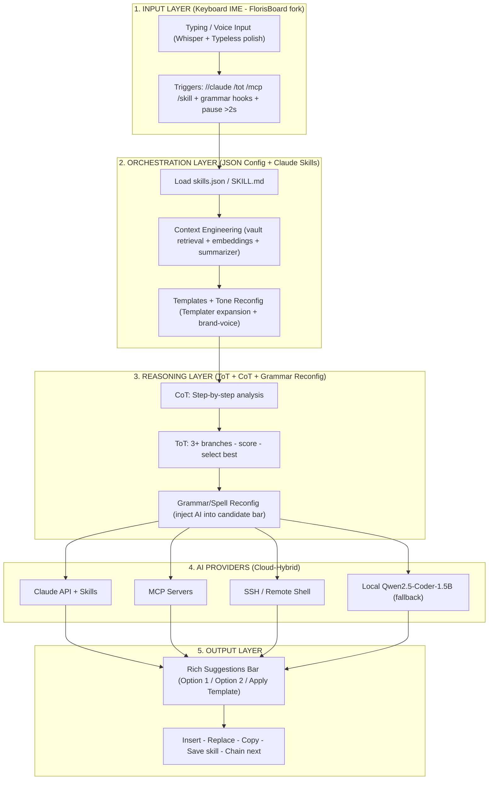
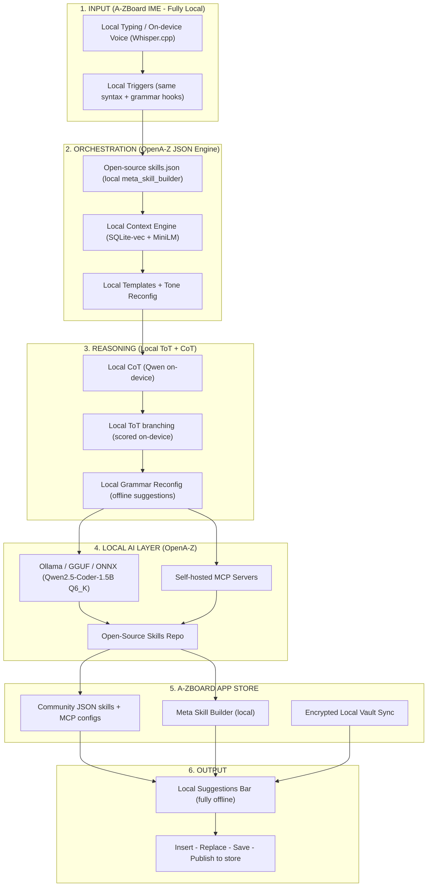

# Architecture

Two design paths for the Android AI Keyboard Harness.

---

## Design 1 — Cloud-Hybrid (Claude API + MCP)

```mermaid
graph TD
    subgraph InputLayer ["1. INPUT LAYER (Keyboard IME - FlorisBoard fork)"]
        direction TB
        TypingVoice["Typing / Voice Input (Whisper + Typeless polish)"]
        Triggers["Triggers: //claude /tot /mcp /skill + grammar hooks + pause >2s"]
    end
    subgraph OrchestrationLayer ["2. ORCHESTRATION LAYER (JSON Config + Claude Skills)"]
        direction TB
        LoadJSON["Load skills.json / SKILL.md"]
        ContextEngine["Context Engineering (vault retrieval + embeddings + summarizer)"]
        Templates["Templates + Tone Reconfig (Templater expansion + brand-voice)"]
    end
    subgraph ReasoningLayer ["3. REASONING LAYER (ToT + CoT + Grammar Reconfig)"]
        direction TB
        CoTStep["CoT: Step-by-step analysis"]
        ToTBranch["ToT: 3+ branches - score - select best"]
        GrammarHook["Grammar/Spell Reconfig (inject AI into candidate bar)"]
    end
    subgraph AIProvidersLayer ["4. AI PROVIDERS (Cloud-Hybrid)"]
        direction LR
        ClaudeAPI["Claude API + Skills"]
        MCPProtocol["MCP Servers"]
        SSHShell["SSH / Remote Shell"]
        LocalLLM["Local Qwen2.5-Coder-1.5B (fallback)"]
    end
    subgraph OutputLayer ["5. OUTPUT LAYER"]
        direction TB
        SuggestionsBar["Rich Suggestions Bar (Option 1 / Option 2 / Apply Template)"]
        Actions["Insert - Replace - Copy - Save skill - Chain next"]
    end
    TypingVoice --> Triggers
    Triggers --> LoadJSON
    LoadJSON --> ContextEngine
    ContextEngine --> Templates
    Templates --> CoTStep
    CoTStep --> ToTBranch
    ToTBranch --> GrammarHook
    GrammarHook --> ClaudeAPI
    GrammarHook --> MCPProtocol
    GrammarHook --> SSHShell
    GrammarHook --> LocalLLM
    ClaudeAPI --> SuggestionsBar
    MCPProtocol --> SuggestionsBar
    SSHShell --> SuggestionsBar
    LocalLLM --> SuggestionsBar
    SuggestionsBar --> Actions
```

---

## Design 2 — Fully Local / Offline-First (GGUF On-Device)

```mermaid
graph TD
    subgraph LocalInput ["1. INPUT (A-ZBoard IME - Fully Local)"]
        direction TB
        LocalTyping["Local Typing / On-device Voice (Whisper.cpp)"]
        LocalTriggers["Local Triggers (same syntax + grammar hooks)"]
    end
    subgraph LocalOrchestration ["2. ORCHESTRATION (OpenA-Z JSON Engine)"]
        direction TB
        LocalJSON["Open-source skills.json (local meta_skill_builder)"]
        LocalContext["Local Context Engine (SQLite-vec + MiniLM)"]
        LocalTemplates["Local Templates + Tone Reconfig"]
    end
    subgraph LocalReasoning ["3. REASONING (Local ToT + CoT)"]
        direction TB
        LocalCoT["Local CoT (Qwen on-device)"]
        LocalToT["Local ToT branching (scored on-device)"]
        LocalReconfig["Local Grammar Reconfig (offline suggestions)"]
    end
    subgraph LocalAI ["4. LOCAL AI LAYER (OpenA-Z)"]
        direction LR
        GGUF["Ollama / GGUF / ONNX (Qwen2.5-Coder-1.5B Q6_K)"]
        LocalMCP["Self-hosted MCP Servers"]
        SkillsRepo["Open-Source Skills Repo"]
    end
    subgraph AppStore ["5. A-ZBOARD APP STORE"]
        direction TB
        PluginMarket["Community JSON skills + MCP configs"]
        SkillBuilder["Meta Skill Builder (local)"]
        VaultSync["Encrypted Local Vault Sync"]
    end
    subgraph LocalOutput ["6. OUTPUT"]
        direction TB
        LocalSuggestions["Local Suggestions Bar (fully offline)"]
        LocalActions["Insert - Replace - Save - Publish to store"]
    end
    LocalTyping --> LocalTriggers
    LocalTriggers --> LocalJSON
    LocalJSON --> LocalContext
    LocalContext --> LocalTemplates
    LocalTemplates --> LocalCoT
    LocalCoT --> LocalToT
    LocalToT --> LocalReconfig
    LocalReconfig --> GGUF
    LocalReconfig --> LocalMCP
    GGUF --> SkillsRepo
    LocalMCP --> SkillsRepo
    SkillsRepo --> PluginMarket
    SkillsRepo --> SkillBuilder
    PluginMarket --> LocalSuggestions
    SkillBuilder --> LocalSuggestions
    VaultSync --> LocalSuggestions
    LocalSuggestions --> LocalActions
```
