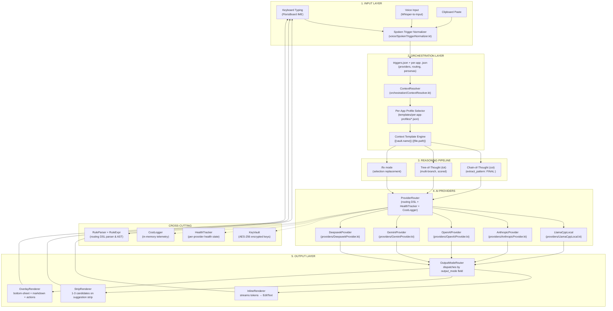

# Architecture — FlorisBoard Vault AI Keyboard

## Overview

Five-layer architecture for an orchestrator-first Android IME. Each layer has a
well-defined interface and can be tested independently. JSON-driven trigger
configuration decouples behaviour from code.

```
        Trigger JSON ──► Layer 2 Orchestration ──► Layer 4 AI Providers
            ▲                                          │
            │                                    Layer 5 Output
            │                                          │
        Layer 1 Input ◄──────────────────────── Layer 5 Output
                                                 (EditText)
```

---

## System Architecture Diagram



---

## Layer Descriptions

### Layer 1: Input
Physical typing, voice transcription (via external whisper-to-input app), and
clipboard paste. Voice input is normalized via `SpokenTriggerNormalizer` which
maps spoken phrases like "slash formal" to canonical trigger tokens like `/formal`.

**Key files:** `ime/ai/voice/SpokenTriggerNormalizer.kt`, `ime/ai/voice/VoiceInputManager.kt`

### Layer 2: Orchestration
The control plane. Resolves the current app context from
`AccessibilityNodeInfo` (e.g., Obsidian window title → vault name + file path),
selects the correct trigger set (`templates/obsidian.triggers.json` vs
`templates/whatsapp.triggers.json`), and substitutes context variables into
template strings (`{{vault.name}}` → `"MyVault"`).

**Key files:** `ime/ai/orchestration/ContextResolver.kt`, `templates/*.json`

### Layer 3: Reasoning Pipeline
Selects the reasoning strategy: CoT (chain-of-thought with optional regex extraction),
ToT (tree-of-thought with multiple scored branches), or /fix (selected text correction).
Configured per-trigger in JSON.

**Configured in:** `templates/triggers.json` (per-trigger `pipeline` field)

### Layer 4: AI Providers
Five provider implementations sharing the same `Provider` interface
(cold `Flow<Token>`). `ProviderRouter` selects the best provider using:
1. Explicit `preferredProvider` from the trigger
2. Budget-based override (`cheap` / `balanced` / `premium`)
3. DSL routing rules (parsed by `RuleParser`)
4. Fallback chain (primary → fallback → healthy providers by priority)

**Key files:** `ime/ai/providers/Provider.kt`, `ime/ai/providers/ProviderRouter.kt`,
`ime/ai/providers/RuleParser.kt`, `ime/ai/providers/HealthTracker.kt`

### Layer 5: Output
Three renderers dispatched by `OutputModeRouter` based on the trigger's
`output_mode` field:
- **inline** — `InlineRenderer` streams tokens to the EditText via `InputConnection`.
  Cancel on any key press; partial text preserved; `/fix` mode replaces selection.
- **strip** — `StripRenderer` shows up to 3 candidates on the suggestion strip.
  Used for ToT (one branch per candidate). Tap to insert, long-press to insert + save snippet.
- **overlay** — `OverlayRenderer` shows a bottom-sheet with Markwon markdown rendering.
  Actions: Insert, Copy, Edit-and-Insert, Save-as-Skill, Discard.

**Key files:** `ime/ai/output/OutputModeRouter.kt`, `ime/ai/output/InlineRenderer.kt`,
`ime/ai/output/StripRenderer.kt`, `ime/ai/output/OverlayRenderer.kt`

---

## Routing DSL

The `RuleParser` parses a tiny expression language for provider routing:

```
expr     → or
or       → and ('||' and)*
and      → cmp ('&&' cmp)*
cmp      → primary (('==' | '!=' | '>' | '<') primary)?
primary  → IDENT | STRING | INT | BOOL | '(' expr ')'
```

**Example rules from triggers.json:**
```
trigger.pipeline == 'tot'                → use anthropic
trigger.maxTokens > 1024                 → use anthropic
provider.local.unreachable               → use gemini_1
provider.gemini_1.rateLimited            → use gemini_2
trigger.budget == 'cheap'                → use deepseek
```

All identifiers resolve via `RuleContext` at runtime. Unknown identifiers
evaluate to `false` (fail-closed).

---

## Key Design Decisions

| Decision | Rationale |
|----------|-----------|
| JSON-driven triggers | No code changes needed for new triggers. Decouples behaviour from app releases. |
| Custom DSL (no ANTLR) | ~200 lines, no build dependency, easy to audit. Grammar fits on a napkin. |
| 3 output modes | Different tasks need different UIs: inline for quick completions, strip for multi-choice, overlay for long-form. |
| Provider routing rules | Health-aware failover without hardcoded fallbacks. Budget routing for cost control. |
| In-memory CostLogger | Privacy-first: no network telemetry. Data survives session only. |
| AES-256 KeyVault | API keys never stored in plaintext on device filesystem. |

---

## File Layout

```
app/src/main/java/dev/patrickgold/florisboard/ime/ai/
├── orchestration/     ContextResolver, LlamaServerService
├── output/            InlineRenderer, StripRenderer, OverlayRenderer, OutputModeRouter
├── providers/         Provider interface, ProviderRouter, RuleParser, RuleExpr,
│                      HealthTracker, CostLogger, KeyVault, and 5 implementations
├── trigger/           Trigger parsing (WIP)
├── voice/             VoiceInputManager, SpokenTriggerNormalizer, WaveformStripRenderer
└── bridges/           Cross-layer wiring (WIP)

app/src/ androidTest/  Instrumentation tests (OutputRenderer, e2e)
         test/         Unit tests (RuleParser, SpokenTriggerNormalizer)

templates/
├── triggers.json           Global: providers, routing, personas, app_profiles
├── obsidian.triggers.json  Obsidian triggers: /doc, /summarize, /link, /daily, /atomic, /moc
├── gmail.triggers.json     Gmail triggers: /reply, /summarize, /formalize, /fix, /draft
├── whatsapp.triggers.json  WhatsApp triggers: /reply, /formalize, /shorten, /translate
├── per-app-profiles/       obsidian.json, gmail.json, whatsapp.json
└── triggers.schema.json    JSON Schema for CI validation

.github/workflows/
└── florisvault.yml         CI: JSON validation, APK build, unit tests, lint
```
