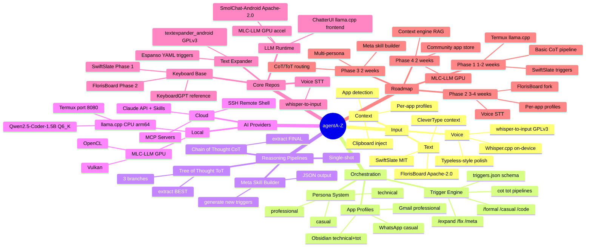

# Project Ecosystem Mindmap

```mermaid
mindmap
  root((agentA-Z))
    Input
      Voice
        whisper-to-input GPLv3
        Whisper.cpp on-device
        Typeless-style polish
      Text
        SwiftSlate MIT
        FlorisBoard Apache-2.0
        CleverType context
      Context
        Clipboard inject
        App detection
        Per-app profiles
    Orchestration
      Trigger Engine
        triggers.json schema
        /formal /casual /code
        /expand /fix /meta
        cot tot pipelines
      Persona System
        professional
        casual
        technical
      App Profiles
        WhatsApp casual
        Gmail professional
        Obsidian technical+tot
    Reasoning Pipelines
      Single-shot
      Chain of Thought CoT
        extract FINAL
      Tree of Thought ToT
        3 branches
        extract BEST
      Meta Skill Builder
        generate new triggers
        JSON output
    AI Providers
      Local
        llama.cpp CPU arm64
          Termux port 8080
          Qwen2.5-Coder-1.5B Q6_K
        MLC-LLM GPU
          OpenCL
          Vulkan
      Cloud
        Claude API + Skills
        MCP Servers
        SSH Remote Shell
    Core Repos
      Keyboard Base
        SwiftSlate Phase 1
        FlorisBoard Phase 2
        KeyboardGPT reference
      Voice STT
        whisper-to-input
      LLM Runtime
        SmolChat-Android Apache-2.0
        ChatterUI llama.cpp frontend
        MLC-LLM GPU accel
      Text Expander
        textexpander_android GPLv3
        Espanso YAML triggers
    Roadmap
      Phase 1 1-2 weeks
        Termux llama.cpp
        SwiftSlate triggers
        Basic CoT pipeline
      Phase 2 3-4 weeks
        FlorisBoard fork
        Per-app profiles
        Voice STT
      Phase 3 2 weeks
        CoT/ToT routing
        Multi-persona
        Meta skill builder
      Phase 4 2 weeks
        Context engine RAG
        MLC-LLM GPU
        Community app store
```
